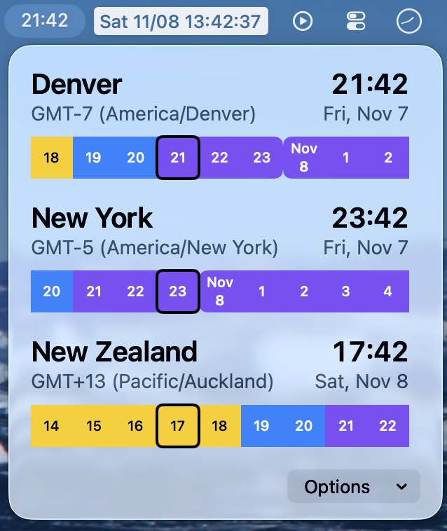

# ManyTime

A Menu Bar time app for macOS, to help you keep track of times in multiple time zones. Are there many apps like this? Yes. But I felt like trying something new, and tracking times across timezones is something I've always found to be tedeious.

There's no built version (yet?) since I haven't committed to paying for an Apple Developer account, but you can build it yourself if you have Xcode installed!

