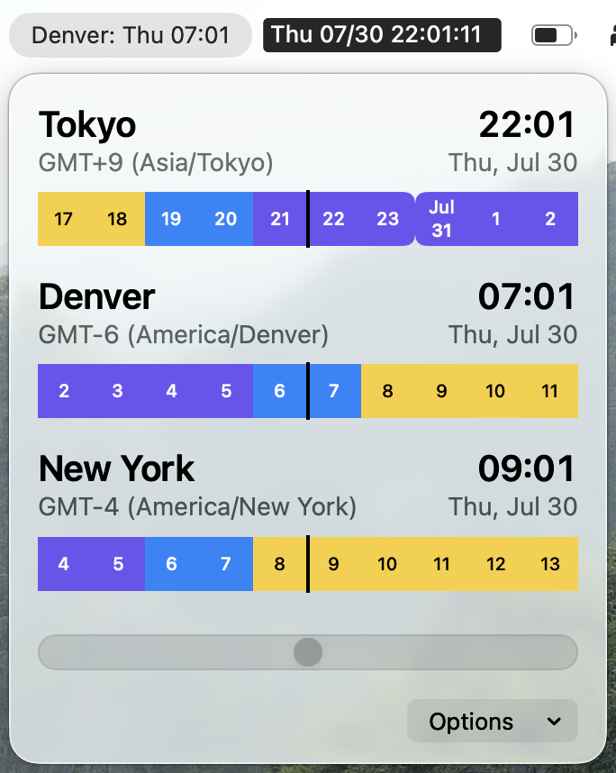

# ManyTime

A Menu Bar time app for macOS, to help keep track of times in multiple time zones. 

There's no notarized version (yet?) since I haven't committed to paying for an Apple Developer account... maybe someday.

## Features

**Add multiple timezones to the Menu Bar, and view them in a dropdown window.**



<br /> 
<br /> 

**Use horizontal scroll to manipulate the time, to view what time it is across your timezones.**

<video src="https://codeberg.org/dmurtari/ManyTime/media/branch/main/images/scrolling.mp4" controls width="300"></video>

## Installation

Either downloed the latest Release from [Releases](https://codeberg.org/dmurtari/ManyTime/releases), or via Homebrew:

```sh
brew tap dmurtari/tap https://codeberg.org/dmurtari/homebrew-tap
brew install --cask dmurtari/tap/manytime
```

## Help

### First Launch

On first launch, there won't be any timezones shown yet. To add them, go to 'Options' > 'Preferences' (Or type Cmd + ,). From there, you'll be able to manage and add new timezones. 

By default, whatever _non-device_ timezone is first in the list will be shown in the Menu Bar. This behavior can be modified in 'Preferences', to always show the first timezone (regardless of whether it's the device timezone)

### Time Formats

You can choose to set the format for the time shown in the Menu Bar, and the time shown in the dropdown window, independently. I use this to show more information in the Menu Bar (like the screenshot)

There are a few presets you can choose from, but you may find the Custom option most useful. The time formats are SwiftUI's standard [Unicode format](https://www.unicode.org/reports/tr35/tr35-dates.html#Date_Format_Patterns), with the additional ability to use `{name}` as a placeholder for the name of the timezone.

For example, to show `Denver: Fri 22:00`, I use the string `{name}: E HH:mm`
